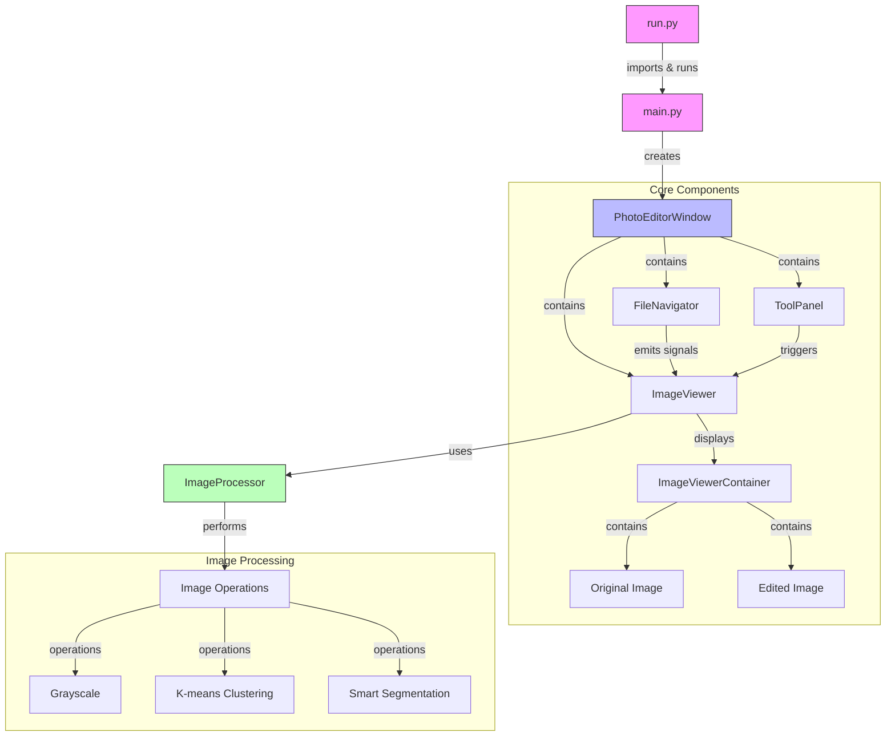

# Photo Editor

A desktop application for image editing and processing built with Python and PySide6.

## Photo Editor Application Architecture

## Main Components
- `FileNavigator`: Browse and select image files
- `ImageViewer`: Display and compare original/edited images
- `ToolPanel`: Access editing operations
- `ImageProcessor`: Handle image processing operations

## Features
- File navigation and management
- Basic image processing operations (grayscale, k-means clustering)
- Advanced segmentation with customizable parameters
- Drag-and-drop interface for image comparison
- Support for multiple image formats

## Requirements
- Python 3.x
- PySide6
- OpenCV (cv2)
- scikit-learn
- scikit-image
- scipy
- numpy

## Installation
1. Clone the repository
2. Install dependencies: `pip install -r requirements.txt`
3. Run the application: `python run.py`

## Development Roadmap

1. **Phase 1: Core Foundation**
   - Basic window setup
   - Simple image loading and display
   - One basic image operation (e.g., grayscale)
   - Unit tests for core functionality

2. **Phase 2: Image Processing**
   - Implement processing operations one by one
   - Add parameter controls
   - Test each operation thoroughly

3. **Phase 3: UI Enhancement**
   - Add file navigation
   - Implement comparison view
   - Add drag-and-drop functionality
   - Test UI interactions
