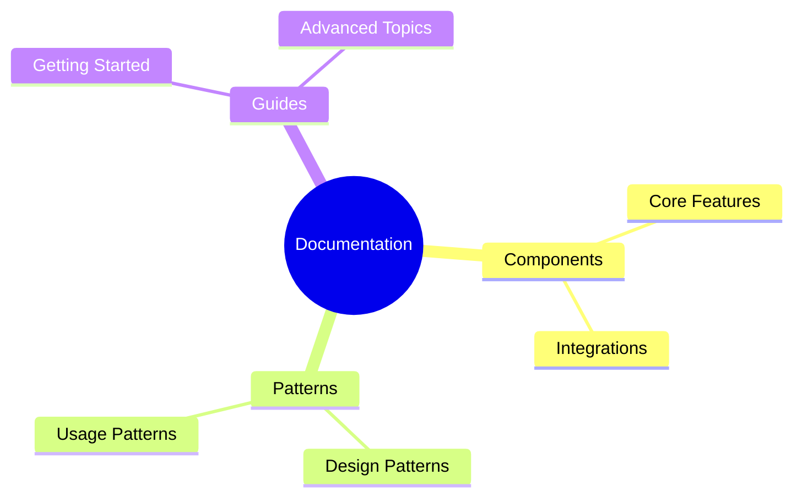

# Project Documentation

## Learning Resources

## Quick Links
- [Getting Started](learning/guides/getting_started.md)
- [Core Components](learning/components/README.md)
- [Design Patterns](learning/patterns/README.md)

## Development Integration
This documentation evolves with the codebase:
1. New features include component documentation
2. Implementation patterns are documented as discovered
3. Learning resources grow with development