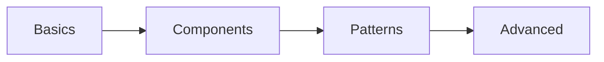

# Learning Paths

## Path Overview

## Getting Started
1. Core Concepts
2. Basic Components
3. Simple Patterns

## Intermediate Development
1. Component Integration
2. Common Patterns
3. Testing Practices

## Advanced Topics
1. Performance Optimization
2. Advanced Patterns
3. Architecture Design