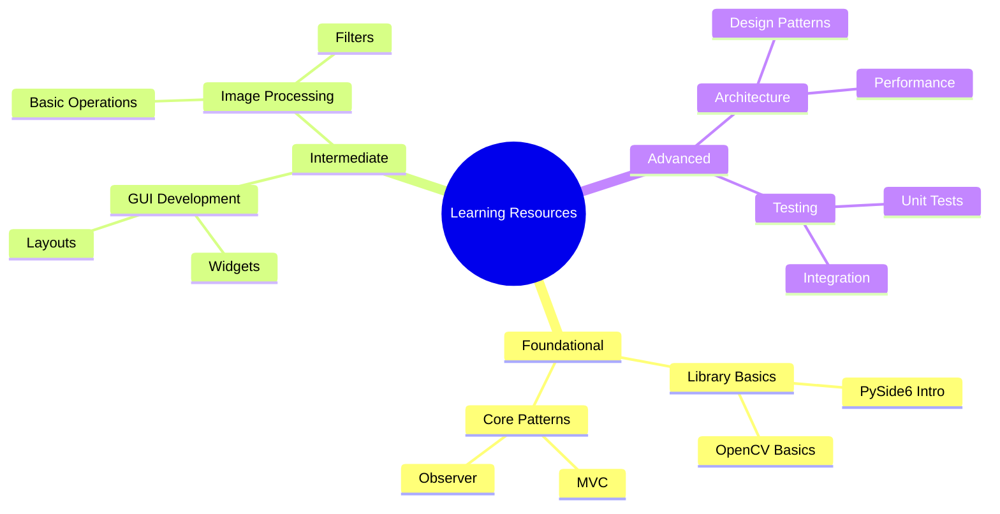

# Learning Resources

## Visual Navigation

## Learning Paths

### 🌱 Beginner Path
1. [Project Setup Guide](guides/project_setup.md)
2. [PySide6 Basics](libraries/pyside6/overview.md)
3. [Basic Patterns](patterns/mvc.md)

### 🌿 Intermediate Path
1. [GUI Development](concepts/gui_principles.md)
2. [Image Processing](libraries/opencv/overview.md)
3. [Testing Basics](libraries/pytest/overview.md)

### 🌳 Advanced Path
1. [Advanced Patterns](patterns/advanced.md)
2. [Performance Optimization](concepts/performance.md)
3. [Architecture Design](architecture/overview.md)

## Resource Categories
- 📚 Libraries
- 🧩 Patterns
- 💡 Concepts
- 📝 Guides