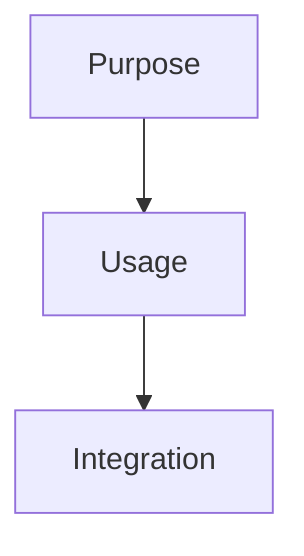

# [Component Name]

## Quick Start


## Core Concepts
### Key Terms
- **Term**: Definition

### Essential Patterns
- Pattern 1: Usage
- Pattern 2: Usage

## Implementation
### Basic Usage
```python
# Example code
```

### Integration Points
- How to integrate
- Common patterns
- Best practices

### Advanced Usage
- Performance considerations
- Edge cases
- Advanced patterns

## Learning Resources
- Links to guides
- Related patterns
- External resources