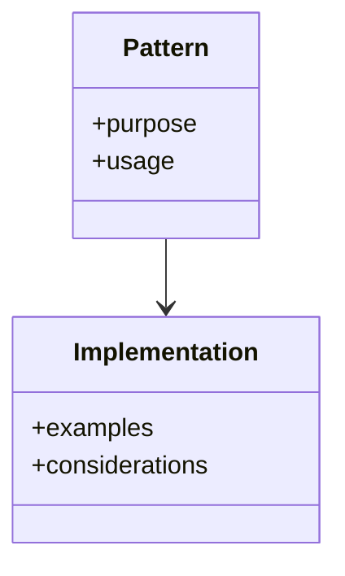

# [Pattern Name]

## Overview


## Core Concepts
- Main idea
- When to use
- Benefits/tradeoffs

## Implementation
### Basic Example
```python
# Example code
```

### Considerations
- Important points
- Common pitfalls
- Best practices

## Related Patterns
- Pattern 1: Relationship
- Pattern 2: Relationship