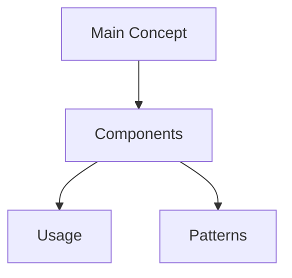

# [Concept Name]

## Visual Overview

## Technical Glossary
### Foundational Concepts
- **Term 1**: Definition
- **Term 2**: Definition

### Intermediate Concepts
- **Term 3**: Definition

### Advanced Concepts
- **Term 4**: Definition

## Overview
- What is it
- Why it matters
- When to use it

## Key Principles
- Core ideas
- Important considerations
- Common misconceptions

## Implementation Examples
- Code examples
- Use cases
- Best practices

## Learning Resources
- Reference materials
- Tutorials
- Further reading

## Personal Notes
- Key insights
- Challenges faced
- Solutions found