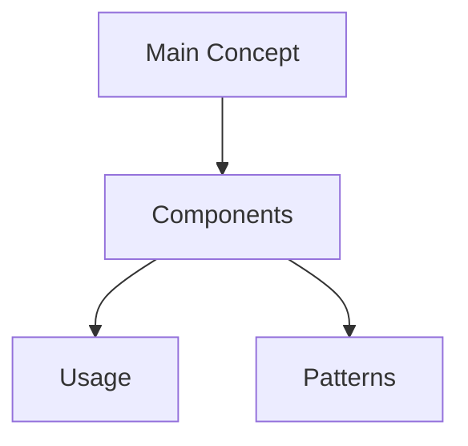

# [Guide Title]

## Visual Overview

## Technical Glossary
### Foundational Concepts
- **Term 1**: Definition
- **Term 2**: Definition

### Intermediate Concepts
- **Term 3**: Definition

### Advanced Concepts
- **Term 4**: Definition

## Purpose
- What this guide covers
- Who it's for
- When to use it

## Prerequisites
- Required knowledge
- Required tools
- Required setup

## Step-by-Step Instructions
1. First step
   - Details
   - Examples
   - Common issues

2. Second step
   - Details
   - Examples
   - Common issues

## Troubleshooting
- Common problems
- Solutions
- Where to get help

## Related Resources
- Related guides
- Documentation links
- External resources