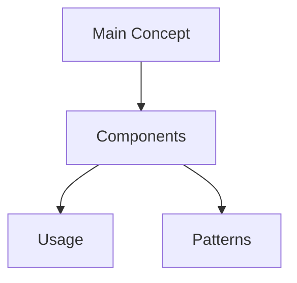

# [Library Name]

## Visual Overview

## Technical Glossary
### Foundational Concepts
- **Term 1**: Definition
- **Term 2**: Definition

### Intermediate Concepts
- **Term 3**: Definition

### Advanced Concepts
- **Term 4**: Definition

## Overview
- Purpose and main use cases
- Core concepts
- Integration with our project

## Key Components
- Essential classes/functions
- Usage patterns
- Common pitfalls

## Project Usage Examples
- Real examples from our codebase
- Why we chose specific approaches
- Lessons learned

## Learning Resources
- Official documentation links
- Helpful tutorials
- Community resources

## Personal Notes
- Challenges encountered
- Solutions discovered
- Tips for future reference