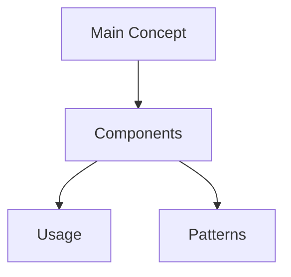

# [Pattern Name]

## Visual Overview

## Technical Glossary
### Foundational Concepts
- **Term 1**: Definition
- **Term 2**: Definition

### Intermediate Concepts
- **Term 3**: Definition

### Advanced Concepts
- **Term 4**: Definition

## Problem It Solves
- What issues this pattern addresses
- When to use it
- When not to use it

## Implementation
- Basic structure
- Key components
- Relationships

## Project Examples
- Where we use it
- Why we chose it
- Implementation details

## Learning Notes
- Common pitfalls
- Best practices
- Related patterns